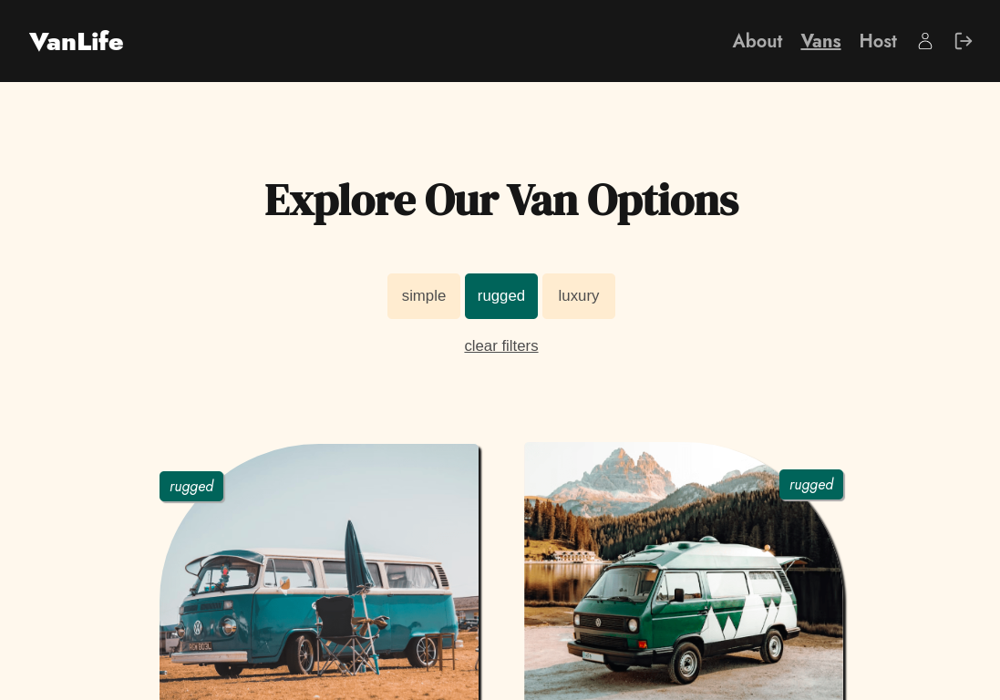

# Van Life

[Português]
Um projeto seguindo o curso Learn React Router v6 com Bob Ziroll na plataforma Scrimba. 
Traga aventura para sua vida e junte-se ao movimento #vanlife. Alugue a van perfeita para a sua viagem perfeita.

[English]
A project following Learn React Router v6 course with Bob Ziroll at Scrimba plattaform.
Bring adventure into your life and join the #vanlife movement. Rent the perfect van for your perfect road trip.

## Getting Started
Para começar no Van Life, siga estes passos:

1. Clonar o repositório: **`git clone https://github.com/jessicasantosb/van-life.git`**
2. Entrar na pasta do projeto: **`cd van-life`**
3. Instalar as dependências: **`npm i`**
4. Iniciar o aplicativo: **`npm run dev`**

## Live Demo

[Português]
Confira a demonstração ao vivo:

[English]
Check out the live demo:

[Live Preview](https://vanlife-jessicasantosb.netlify.app/)

## Screenshot

## Technology Stack

- React
- React Router Dom v6
- Firebase

## Author

Created by Jessica Bandeira.

- LinkedIn: [Jessica's LinkedIn Profile](https://www.linkedin.com/in/jessica-santosb/)

## Known Issues and Future Improvements

[Português]

- Mencione quaisquer problemas conhecidos ou limitações.
- Esboce seus planos para melhorias futuras.

[English]

- Mention any known issues or limitations.
- Outline your plans for future improvements.